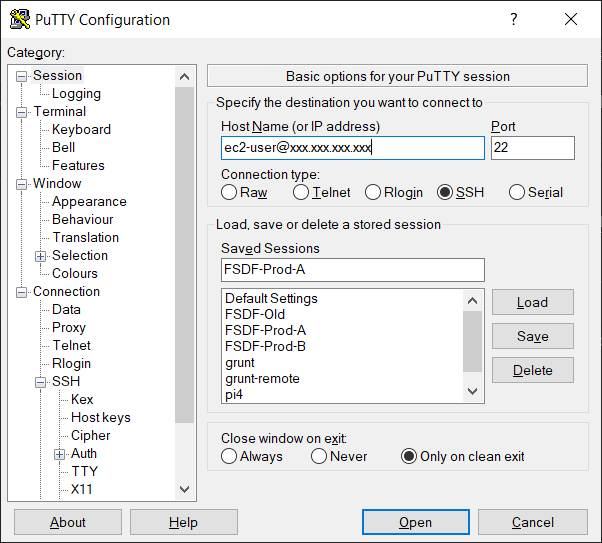
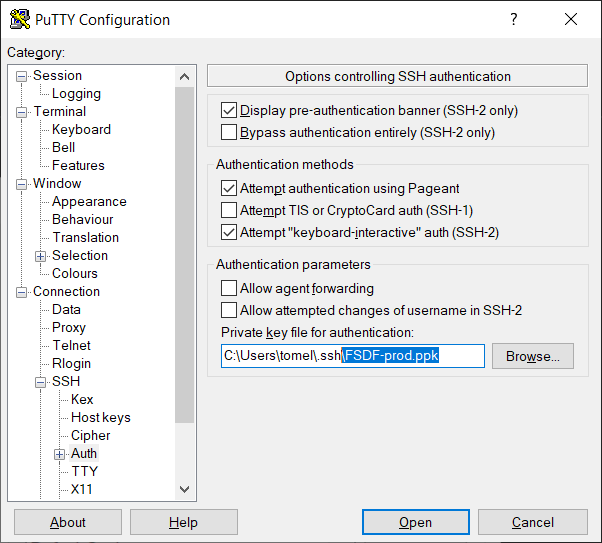
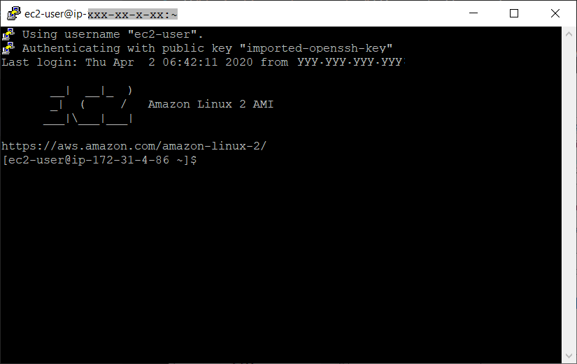

# fsdf-setup
Journals building from an AWS instance with ssh access, provisioning required packages, the deployment of FSDF applications, the creation of services and installing cron jobs to provision data and freshen tokens. 
## Introduction
FSDF has a number of applications that have been released as production code. Each has a common code base but the build 
and deployment differs across the web applications. There are also artefacts that are outside of the code base completely.
Setting up the environment has a number of facets.
* Languages to support the running of the applications.
* Tools to support the deployment of applications.
* Tools to support the running of cron jobs.
* Services, both common infrastructure and bespoke services to run the applications as services.
## Accessing the EC2 instance
The AWS EC2 instances are provided to work on. Setting up those instances are outside the scope of this project. Suffice to say that they have the following characteristics:
* Linux AMI with
* 4GB RAM
* 2 Cores
* 30GB SSD
* SSH installed
* User name is `ec2-user`
* Logon restricted to certain hosts. Ensure your development machine is allowed to access the instance. Generally if you are seated in GA you are fine.
* Requires the exchange of keys. You need a private key (PPK file) provided to you to logon.


*Fig. 1: Initial form for Putty*


*Fig. 2: Link to your provided PPK file*

Replace the ip in figure 1 with that provided by the FSDF AWS administrator and you should be able to logon by using the `Open` button.



*Fig. 3: Succcessful logon to an FSDF AWS EC2 instance*

At this point we need a few tools to run our applications. 

We do need to install git and then we can bootstrap the installation of tools.

```Bootstrap the tools
sudo yum -y update
sudo yum install -y git
git clone https://github.com/Tomella/fsdf-setup.git
bash fsdf-setup/tools/bootstrap
```

We need:
* Git. For downloading all of the applications.
* Node JS
* Apache HTTP server
* Linux build tools
* Forever which allows applications to restaart on failure. Used in the services for the applications
* Bower, a client side packaging tool. It is deprecated but we aren't funded to replace it at this stage

## Prepare the user account
There are a few keys to getting the user account prepared to run the system. The scripts here build or prompt you for variables to make that happen.

* System variables. The `~/.bash_profile` needs to export a number of secret or environment specific variables for the applications to talk to others. The script reads the current values and if there are any missing prompts you to add the values and on collecting those values appending them to the file.
* Jobs to be run. There are scheduled jobs that need to be run such as building Solr searches and renewing tokens. The script looks for the job names in the current cron table and if they are not there adds them to the table.


## Applications to be installed
There are a number of bespoke applications and dependencies that need to be installed.
* [Apache Configuration](https://github.com/Tomella/apache-configuration "Configures the applications as deployed on the host") This is a one stop shop for all the routing and proxying of services through the HTTPD server. 
* [Elevation](https://github.com/Tomella/fsdf-elvis "Elvis application") The application sometimes known as Elvis.  
* [Placenames](https://github.com/Tomella/elvis-placenames "Placenames") Gazetteer search and download.
* [Solr](https://github.com/Tomella/gazetteer "Gazetteer data in Solr") Solr provisioned with gazetteer data
* [Upload](https://github.com/Tomella/elvis-upload "Gazetteer data upload") A secured site for gazetteer data to be uploaded by jurisdictions 

## Apache Configuration
As mentioned above, install the Apache configuration. Order isn't that important. At some prior to delivering via the web this has to be configured and it is automated through the [bootstrap program](tools/bootstrap "Rudimentary bash script to load core apps"). If you have run the bootstrap program the server is up and running. If it fails to load look at the output for hints or check the project for changes.

## Elevation
This is the flagship of the fleet and again the 